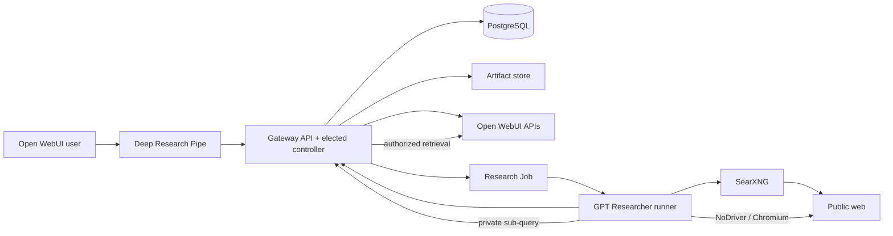

# Open WebUI GPT Researcher

Asynchronous, multi-user deep research for
[Open WebUI](https://github.com/open-webui/open-webui), powered by
[GPT Researcher](https://github.com/assafelovic/gpt-researcher).

Users start and follow long-running research from an ordinary Open WebUI chat. The integration
plans searches, reads public and private sources, produces a cited report, and attaches its files
to the final message. Research survives browser disconnects and can continue iteratively in the
same chat.

## Use cases

- Investigate a company, market, technology, regulation, or technical design across many sources.
- Combine public-web evidence with Open WebUI attachments and Knowledge collections.
- Continue a previous investigation and receive a **Changes since previous iteration** section.
- Reference another accessible chat as read-only research context.
- Run private-only research over internal documents when public search is disabled.
- Download generated reports and source records or explicitly save a report to Open WebUI
  Knowledge for later reuse.

## User experience

1. Select **Deep Research** in Open WebUI and submit a question.
2. Choose models for the fast, smart, and strategic research roles.
3. Choose a research strategy and review the resolved plan and operational limits.
4. Follow accurate planning, search, reading, writing, and finalization status updates in chat.
5. Receive the report and generated artifacts as native Open WebUI file attachments.
6. Optionally invoke **Save report to Knowledge**.

The default research shapes are:

| Strategy | Breadth | Depth | Queries per branch | Estimated maximum queries |
| --- | ---: | ---: | ---: | ---: |
| `focused` | 1 | 1 | 2 | 5 |
| `balanced` | 2 | 2 | 2 | 25 |
| `broad` | 4 | 2 | 2 | 49 |
| `deep` | 2 | 3 | 3 | 71 |
| `custom` | user value | user value | user value | calculated before submission |

The query limit is an independent hard ceiling on the logical research tree. A custom tree must
fit both the user's limit and the administrator cap before it can start; querying multiple private
and public retrievers for the same research question does not multiply that user-visible count.

## Usage examples

### Start a research thread

```text
Compare the available approaches to running multi-user deep research in Open WebUI.
Include architecture, security boundaries, operational tradeoffs, and primary-source evidence.
```

### Continue an investigation

Submit a follow-up in the same chat:

```text
Revisit the report using the newly attached design document. Focus on changed conclusions and
list everything that differs from the previous iteration.
```

The earlier chat messages, successful reports, files, and Knowledge selections become context for
the next iteration. A new chat starts an independent research thread.

### Include another chat

Use Open WebUI's **More → Reference Chats** picker before submitting the research request. Directly
referenced chats are included only when the current user can access them; references are not
followed recursively.

### Research only private sources

An administrator can disable public search. Attach files or select Knowledge before starting the
request; a private-only job without any private context is rejected.

## How it works



Open WebUI remains authoritative for users, model access, chats, attachments, Knowledge, and
embeddings. PostgreSQL stores durable job state and events. Kubernetes installations create one
`batch/v1 Job` per research run; local installations start equivalent runner subprocesses.

See [Architecture decisions](docs/adrs.md) for the detailed boundaries and tradeoffs.

## Deployment options

- Docker Compose provides the complete local development and review bundle.
- The Helm chart deploys the production gateway, research Jobs, migrations, cleanup, Function
  synchronization, and optionally SearXNG.
- The chart is published as an OCI artifact for Argo CD installations.

Follow [Installation and Open WebUI integration](docs/installation.md) for complete instructions.

## Documentation

- [Deep Research user guide](docs/usage.md)
- [Посібник користувача Deep Research українською](docs/usage-uk.md)
- [Installation and Open WebUI integration](docs/installation.md)
- [Development guide](docs/development.md)
- [Architecture decisions](docs/adrs.md)
- [Roadmap](docs/roadmap.md)
- [Contributing](CONTRIBUTING.md)
- [Security policy](SECURITY.md)

## License

MIT. GPT Researcher and Open WebUI retain their respective licenses.
