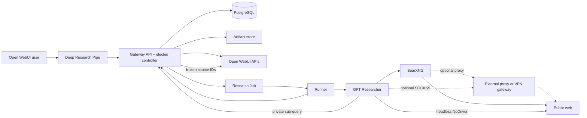

# Open WebUI GPT Researcher

Asynchronous, multi-user deep research for
[Open WebUI](https://github.com/open-webui/open-webui), powered by
[GPT Researcher](https://github.com/assafelovic/gpt-researcher).

## Accepted decisions

- Open WebUI owns users, chats, attachments, Knowledge, model access, and embeddings.
- Each run uses the initiating user's Open WebUI model catalog. The user selects the fast, smart,
  and strategic roles before approval, and the selected IDs and Open WebUI-published limits are
  frozen with the job.
- A Pipe submits research and automatically attaches completed artifacts to its response; an
  Action explicitly saves the report to Knowledge.
- GPT Researcher runs behind a durable gateway. Its MCP server is not the control plane.
- `local` mode embeds dispatch and starts real runner subprocesses; `k8s` mode uses elected
  controllers and one literal `batch/v1 Job` per research run. There is no mock engine.
- PostgreSQL stores queue/state and provides leader election. S3-compatible storage holds
  production artifacts. Valkey and a project-specific vector database are not required.
- SearXNG discovers public URLs and headless NoDriver/Chromium extracts selected pages. Public
  search may be disabled when the job has an attachment or Knowledge source.
- Public searches pass through the gateway for atomic per-job accounting. Untrusted snippets and
  pages are bounded before they enter model prompts.
- Research shape and resource limits are separate: users choose a focused, balanced, broad, deep,
  or custom tree, while `max_queries` remains an administrator-bounded safety ceiling.
- The gateway reserves a conservative input-token estimate before a model call, reconciles it with
  provider-reported usage, and terminates impossible jobs with the actual budget reason.
- Only the gateway holds the Open WebUI integration account API key. A runner receives a random,
  scoped, per-job credential.
- Function sync is targeted and idempotent. It does not replace unrelated Functions or interrupt
  an already accepted run.
- Reports are saved to Knowledge only when the user explicitly invokes the Action.
- Final reports follow an explicitly requested language, otherwise the language of the latest
  research request. Integration-generated continuation instructions do not influence that choice.
- Public search and crawling may independently use an optional externally managed proxy or VPN
  gateway. This project provides connection hooks but does not manage that infrastructure.
- A chat is a research thread: later requests inherit its prior messages, files, Knowledge, and
  reports. A new chat starts a new thread; natively referenced chats become read-only context.
- Continuation reports deduplicate source identities and always expose a **Changes since previous
  iteration** section.
- Runtime Jobs are owned by the gateway Deployment and runner Pods are owned by their Job, so
  Argo CD displays Deployment → Job → Pod.
- GPT Researcher is pinned to an exact source revision because the current PyPI `0.16.0` artifact
  predates its importability fix.

## Architecture



The source manifest is frozen on submission. GPT Researcher's generated private sub-queries go
through Open WebUI retrieval, so attachments and Knowledge participate throughout the run without
coupling this service to Open WebUI's selected vector-store implementation.

The Pipe keeps Open WebUI's normal streamed completion open while the durable job runs, emitting
application-level keepalives and UI status events. Progress reports stable lifecycle phases,
per-batch search completion, the latest search started, successful page reads, connected-tool
results, and final distinct web-URL counts. Vendor-specific GPT Researcher telemetry is filtered,
aggregated, and deduplicated before it becomes a durable event; raw logs and partial report output
are not exposed. The final report therefore passes through Open WebUI's own completion persistence
rather than relying on a public researcher URL or on an out-of-band rewrite of another user's
message. On success, the Pipe uploads every generated artifact with the initiating user's
authorization and emits native Open WebUI file attachments. The job itself remains durable if the
browser disconnects; its event and artifact records are not tied to the browser connection.

## Local installation

Prerequisites are Docker Compose and enough memory for Open WebUI plus one Chromium-backed runner.

```bash
cp .env.example .env
docker compose up -d --build
```

Open <http://localhost:3000>, create the first administrator and a dedicated integration account,
then generate an API key for that account. Grant research users read access in Open WebUI to the
underlying models they should be allowed to select. Put the key and suggested model IDs into `.env`:

```dotenv
OPENWEBUI_API_KEY=...
DEFAULT_MODEL_PROFILES={"default":{"fast":"fast-model-id","smart":"report-model-id","strategic":"planning-model-id"}}
REASONING_EFFORT=low
PUBLIC_SEARCH_ENABLED=true
RETRIEVER=searx
SCRAPER=nodriver
SEARX_URL=http://searxng:8080
```

The default profile only orders the suggested choices in the per-run model picker. It does not
grant access or force a model. The gateway intersects the model IDs returned with the initiating
user's authorization with metadata returned by Open WebUI to the integration account. This is
necessary because Open WebUI can omit provider limits from the user-scoped response; it preserves
the user's access boundary while keeping Open WebUI authoritative. The user chooses separate model
IDs for GPT Researcher's `fast`, `smart` (report writing), and `strategic` (planning/analysis) roles
for every run.

When Open WebUI publishes `context_length` and `max_output_tokens`, those authoritative values are
used automatically. A model with incomplete metadata remains selectable, but selecting it opens a
required per-run form for the user to provide and confirm both limits. The pipe accepts whole token
counts, requires a context window of at least 4,096 tokens, and rejects an output limit larger than
the context window. Invalid values are prompted again and no job is submitted without valid limits.
Users should verify manually entered limits against the actual provider deployment; the values are
not inferred by the researcher.

Both Open WebUI-provided and user-provided limits are frozen in the submitted job. This makes a
running job reproducible even if Open WebUI metadata changes later. There is intentionally no
administrator-side fallback map or duplicate model-window configuration in the researcher.
For reasoning models, allow enough output budget for hidden reasoning tokens;
models that spend their entire completion allowance on reasoning are unsuitable
for report writing unless their output limit and reasoning settings are tuned.
`REASONING_EFFORT` is optional; set it when a reasoning model is exposed under a
custom OpenWebUI ID that GPT Researcher cannot classify by name.

Apply the configuration and import/update the two Open WebUI Functions:

```bash
docker compose up -d --build --force-recreate api
docker compose run --rm function-sync
```

Open WebUI is on <http://localhost:3000>, the gateway API on
<http://localhost:8090/docs>, SearXNG on <http://localhost:8081>, and the MinIO console on
<http://localhost:9001>. The default stack performs real search, browsing, and model requests.

To run private-only research, set `PUBLIC_SEARCH_ENABLED=false`, recreate `api`, rerun
`function-sync`, and select at least one attachment or Knowledge source.

### Optional external proxy hook

Direct egress remains the default. The optional `docker-compose.proxy.yaml` overlay starts an
OpenVPN client with an internal SOCKS5 proxy and defaults to the gitignored
`dev/searxng/settings.local.yml`. `SEARXNG_SETTINGS_FILE` can override the host file; it is always
mounted at SearXNG's `/etc/searxng/settings.yml` container path.
Set `OPENVPN_CONFIG_DIR` to the directory containing the client configuration and any referenced
certificates and set `OPENVPN_AUTH_FILE` to a two-line file containing the username on the first
line and password on the second. Both variables are required; `OPENVPN_CONFIG_NAME` is optional and
defaults to `client.ovpn`. Then run `make run-proxy`. The directory is mounted read-only, the auth
file is mounted as a Compose secret, and neither is included in an image.

### Optional Firecrawl experiment

Firecrawl is retained only as a future comparison/integration overlay; it is not part of the
default stack or production recommendation. It introduces its own PostgreSQL, Redis, Playwright,
API, and worker processes. Run it explicitly with:

```bash
docker compose -f docker-compose.yml -f docker-compose.firecrawl.yaml up -d --build
```

The overlay deliberately has no RabbitMQ or extract worker. Revalidate its topology against the
chosen Firecrawl revision before considering production use.

After upgrading a checkout that previously ran Firecrawl by default, stop its old containers with
`docker compose down --remove-orphans` before starting the new default stack. Named data volumes are
retained unless `--volumes` is added.

## Kubernetes installation

Prerequisites:

- Open WebUI with `ENABLE_API_KEYS=true` and a dedicated integration account API key;
- Open WebUI read access for each research user or group to the underlying models they may select;
- PostgreSQL and an S3-compatible bucket;
- a published image from this repository; and
- allowed network paths between the research namespace and those services.

The chart does not create or interpret Secrets. Inject externally managed Secrets or ConfigMaps
with each component's native `envFrom` list. Secret keys must be the runtime environment names,
such as `DATABASE_URL`, `SERVICE_TOKEN`, `SIGNING_SECRET`, `OPENWEBUI_API_KEY`,
`S3_ACCESS_KEY_ID`, and `S3_SECRET_ACCESS_KEY`. The API and its embedded controller share
`DATABASE_URL`; bundled
SearXNG normally receives `SEARXNG_SECRET` through `searxng.envFrom`. Research Jobs need provider
credentials only when `researchJob.env.MODEL_ROUTE=direct`.

Create a production values file, for example:

```yaml
api:
  env:
    OPENWEBUI_URL: http://open-webui.open-webui.svc.cluster.local:8080
    SEARX_URL: http://research-open-webui-gpt-researcher-searxng:8080
    S3_ENDPOINT_URL: https://s3.example.com
    S3_BUCKET: research-artifacts
  envFrom:
    - secretRef:
        name: research-api

researchJob:
  env:
    CRAWLER_PROXY_URL: ""

searxng:
  enabled: true
  envFrom:
    - secretRef:
        name: research-searxng
```

Install the chart:

```bash
helm upgrade --install research ./chart/open-webui-gpt-researcher \
  --namespace research --create-namespace \
  --values values.production.yaml
```

The chart runs schema migration, deploys one gateway Deployment, and runs an idempotent Function
sync Job. Each gateway replica serves the API and runs a controller task in the same process.
PostgreSQL session advisory locks elect one active controller, so API replicas remain horizontally
scalable; use a direct or session-pooled database connection, not a transaction-pooling proxy.
Because that process creates and reconciles Jobs, its ServiceAccount receives namespace-scoped Job
permissions. Runner Jobs use a non-root, read-only security context, resource limits, deadline,
scoped token, and TTL. The image contains Chromium for NoDriver.

Configuration is grouped by runtime component under `api`, `researchJob`, and `searxng`.
Controller settings live in `api.env` because the controller is part of the API process. Migration,
Function sync, and cleanup use the API image, environment, `envFrom`,
security contexts, scheduling, image-pull secrets, extra volumes, and mounts; their own blocks
control enablement, lifecycle, schedule, and resources. Research Jobs are always available when
the controller is running and have no separate `enabled` switch.

SearXNG is opt-in. With `searxng.enabled=true`, the chart deploys one internal SearXNG Deployment
and Service. Set `api.env.SEARX_URL` explicitly to that Service, or to an existing installation
when `searxng.enabled=false`. The chart does not rewrite environment values. The gateway, not
runner Pods, calls SearXNG. No PostgreSQL extension is required for this project's schema.

For an optional externally managed proxy or VPN gateway, set
`researchJob.env.CRAWLER_PROXY_URL` and add the corresponding `outgoing.proxies` block to
`searxng.config` for the bundled search service. The chart does not deploy the proxy or VPN
component.

### OCI chart and Argo CD

A `v*` release tag publishes:

- `ghcr.io/yevheniisemendiak/open-webui-gpt-researcher:VERSION`;
- `oci://ghcr.io/yevheniisemendiak/charts/open-webui-gpt-researcher:VERSION`.

Example Argo CD source:

```yaml
source:
  repoURL: ghcr.io/yevheniisemendiak/charts
  chart: open-webui-gpt-researcher
  targetRevision: 0.1.0
  helm:
    valuesObject:
      api:
        env:
          OPENWEBUI_URL: http://open-webui.open-webui.svc.cluster.local:8080
          SEARX_URL: http://research-open-webui-gpt-researcher-searxng:8080
          S3_ENDPOINT_URL: https://s3.example.com
          S3_BUCKET: research-artifacts
        envFrom:
          - secretRef:
              name: research-api
      searxng:
        enabled: true
        envFrom:
          - secretRef:
              name: research-searxng
```

For private GHCR packages, configure an OCI Helm repository credential in the Argo CD namespace
and a separate image-pull Secret in the research namespace. Public packages need neither.

## Open WebUI integration

Function sync manages only `deep_research`, its model metadata, and the
`save_deep_research_to_knowledge` action using Open WebUI APIs. It associates the action only with
the Deep Research model. Existing user Valves, unrelated Functions, and unrelated model actions are
preserved. If API-key route restrictions are enabled, allow Function and model management plus the
chat-completion, embedding, retrieval, chat-event, file, and Knowledge routes used by the
integration.

The research gateway remains cluster-internal. At successful completion, the Pipe downloads all
artifacts over the private network and uploads them to Open WebUI with the initiating user's
authorization, so Open WebUI renders native file cards and enforces normal ownership. **Attach
research files** remains available only as an idempotent recovery action for historical messages or
an interrupted attachment transfer; normal completion requires no click. **Save report to
Knowledge** remains a separate explicit action and creates or updates Knowledge as the current user.
No public researcher ingress is required. `api.env.ARTIFACT_BASE_URL` is retained only for direct
API clients that explicitly want signed artifact URLs; chat rendering does not use those URLs.

### Iterative and linked-chat research

- Submit another Deep Research request in the same chat to create the next numbered iteration.
  The latest successful job is recorded as its parent.
- Start a new chat to start an independent research thread.
- Use Open WebUI's **More → Reference Chats** picker to link another chat. The Pipe reads only
  references the current user can access and snapshots their active message branches.
- Current-chat and directly linked-chat messages, attachments, and Knowledge selections are
  included. Linked chats are not followed recursively, preventing accidental context expansion.
- Conversation context is deterministically bounded by the Pipe's `context_char_limit` Valve.
- Reports and source records are deduplicated per run. Saving any report to Knowledge remains an
  explicit user action.

Because the native completion stays open, proxies in front of Open WebUI must permit streaming
responses for at least the configured research wall-time. The Pipe emits an empty structured
completion chunk every `job_poll_interval_seconds` (five seconds by default) to keep ordinary idle
timeouts from firing.

## Budgets and recovery

Users select a research strategy through their Function User Valves:

| Strategy | Breadth | Depth | Queries per branch | Estimated maximum queries |
| --- | ---: | ---: | ---: | ---: |
| `focused` | 1 | 1 | 2 | 5 |
| `balanced` | 2 | 2 | 2 | 25 |
| `broad` | 4 | 2 | 2 | 49 |
| `deep` | 2 | 3 | 3 | 71 |
| `custom` | user value | user value | user value | calculated at submission |

For `custom`, `breadth`, `depth`, and `queries_per_branch` are exposed directly. Breadth controls
parallel research directions, depth controls recursive follow-up levels, and queries per branch
maps to GPT Researcher's `MAX_ITERATIONS`. The Pipe displays the resolved shape and estimated
maximum before approval. Every job freezes that shape, so later Valve changes do not affect a
running job.

`max_queries` is independent of the shape: it is a hard search-query budget, not a request for more
research. The Pipe rejects a shape whose estimate exceeds the user's budget and rejects a user
budget above its administrator-controlled `max_queries_cap`. Function sync sets that cap from the
service's `HARD_MAX_QUERIES`, and the API validates it again. The estimate follows GPT Researcher's
current tapered tree and per-worker planning behavior; actual use can be lower when a branch ends
early. One query may return and scrape multiple URLs.

Users also refine input-token, output-token, and wall-time budgets through Function Valves;
administrator hard caps validate those values at submission. Input estimation is intentionally
model-agnostic and conservative because Open WebUI may route many tokenizer families. Actual token
accounting uses the provider's reported usage.

State and ordered events are durable in PostgreSQL. Expiring dispatch leases recover controller
crashes before a runner starts. Active runners send durable heartbeats; if a heartbeat expires, the
controller stops any remaining executor, retries the job from scratch up to `RUNNER_MAX_ATTEMPTS`,
and then fails it explicitly. `RUNNER_HEARTBEAT_SECONDS` defaults to 10 and
`RUNNER_STALE_SECONDS` defaults to 60. Token and query usage remains cumulative across retries, so
recovery cannot bypass the user's original budget.
Scheduled cleanup removes expired events, artifacts, jobs, and orphaned objects. Runtime settings
use direct uppercase names such as `DATABASE_URL`, `DEFAULT_MODEL_PROFILES`, `SEARX_URL`, `JOB_ID`,
`CRAWLER_PROXY_URL`, and `RUNNER_TOKEN`. The Helm chart exposes operator-provided settings under
each component's `env` and `envFrom`; it does not render or own credentials.

## Development

```bash
make setup
make format
make lint
make test
make build
make helm-lint
```

Tests fake external boundaries only; production has no mock research engine.

## Decision evidence

- [Open WebUI Function types](https://docs.openwebui.com/features/extensibility/plugin/functions/)
- [Open WebUI API keys](https://docs.openwebui.com/features/authentication-access/api-keys/)
- [Open WebUI Function API implementation](https://github.com/open-webui/open-webui/blob/main/backend/open_webui/routers/functions.py)
- [GPT Researcher configuration](https://docs.gptr.dev/docs/gpt-researcher/gptr/config)
- [GPT Researcher import fix in the pinned revision](https://github.com/assafelovic/gpt-researcher/commit/bea0ad07c3ead12517c79e03789da49a270fd249)
- [SearXNG search API](https://docs.searxng.org/dev/search_api.html)
- [SearXNG outbound proxy settings](https://docs.searxng.org/admin/settings/settings_outgoing.html)
- [NoDriver implementation used by pinned GPT Researcher](https://github.com/assafelovic/gpt-researcher/blob/master/gpt_researcher/scraper/browser/nodriver_scraper.py)
- [Helm OCI registries](https://helm.sh/docs/topics/registries/)
- [Argo CD Helm/OCI repositories](https://argo-cd.readthedocs.io/en/stable/operator-manual/declarative-setup/#helm)
- [PostgreSQL advisory locks](https://www.postgresql.org/docs/current/explicit-locking.html#ADVISORY-LOCKS)
- [Argo CD resource tracking](https://argo-cd.readthedocs.io/en/stable/user-guide/resource_tracking/)

## License

MIT. GPT Researcher and Open WebUI retain their respective licenses.
