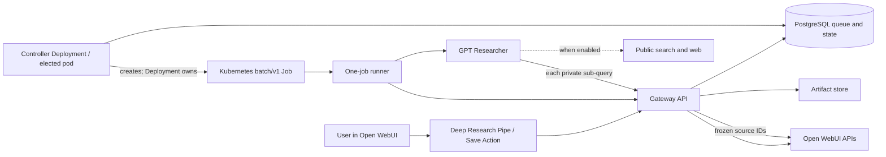

# Open WebUI GPT Researcher

A production-oriented bridge that adds asynchronous, multi-user deep research to
[Open WebUI](https://github.com/open-webui/open-webui) using
[GPT Researcher](https://github.com/assafelovic/gpt-researcher).

Users approve a research plan in Open WebUI, can leave the chat while the work runs, and
receive a Markdown report with downloadable notes, sources, and run metadata. A separate
Action explicitly saves a completed report into Open WebUI Knowledge.

## Accepted decisions

- Open WebUI remains the user-facing system and authority for users, chats, attachments,
  and Knowledge.
- Integration uses an Open WebUI Pipe plus Action; it does not patch Open WebUI.
- A dedicated gateway/controller/runner service embeds the GPT Researcher Python package.
  GPT Researcher's MCP server is not used as the control plane.
- Production uses one literal Kubernetes `batch/v1 Job` per research run. The Helm default
  admits five concurrent jobs; administrator caps allow runs up to two hours.
- PostgreSQL is both durable state and queue. Valkey is not required. S3-compatible storage
  is the production artifact backend; filesystem storage is available for tests and simple
  development.
- Open WebUI remains the vector-store abstraction. GPT Researcher never connects directly to
  pgvector or another deployment-specific vector database.
- The gateway is the only component that receives the Open WebUI integration-account API key.
  A runner gets a random credential valid only for its own job.
- Saving reports to Knowledge is explicit. Nothing automatically creates Knowledge collections.
- LLM access defaults to a budget-enforcing OpenAI-compatible proxy through Open WebUI.
  Direct provider access remains an opt-in deployment mode.
- Tavily is not a platform dependency. Public web retrieval is configurable and can be disabled;
  in that mode, every run must select at least one Open WebUI attachment or Knowledge source.
- The research API stays on a ClusterIP by default. Browser access is needed only when direct,
  signed artifact download links are enabled.
- Controllers elect one active dispatcher through a PostgreSQL session-level advisory lock. The
  same mechanism works in Kubernetes and Compose without adding a second coordination system.
- Runtime Jobs have a Kubernetes owner reference to the stable controller Deployment; runner Pods
  are owned by their Jobs. Argo CD can therefore show Deployment → Job → Pod in the application
  resource tree without treating generated Jobs as Git-managed manifests.

## Architecture



The source manifest is copied from the current Open WebUI chat context at approval time. GPT
Researcher uses the gateway-backed custom retriever for its generated sub-queries, so attached
files and Knowledge participate throughout research rather than only in the final prompt.

## Repository layout

- `src/open_webui_gpt_researcher`: API, durable job repository, controller, executors, runner,
  GPT Researcher adapter, Open WebUI gateway, and artifact stores.
- `openwebui_functions`: importable Pipe and Save-to-Knowledge Action.
- `chart/open-webui-gpt-researcher`: production Helm chart.
- `docker-compose.yml`: full local Open WebUI, PostgreSQL, MinIO, API, and controller bundle.
- `tests`: API lifecycle, authorization, budgets, artifacts, engine, and Function contract tests.

## Installation

The integration has two separately installed parts: the researcher service and two Open WebUI
Functions. The Function source files are imported into Open WebUI; they are **not** copied into
the Open WebUI container filesystem. Open WebUI persists Functions in its own database, so a pod
mount would have no effect on the Function registry and would disappear with the pod.

### 1. Prepare Open WebUI

1. Enable Open WebUI API keys with `ENABLE_API_KEYS=true` and restart Open WebUI if that setting
   changed.
2. Create a dedicated integration/service account. An administrator account can be used in a
   controlled environment, but a dedicated account makes audit and later permission reduction
   easier.
3. Sign in as that account and create an API key. Store and inject it using the deployment's
   normal secret-management mechanism; end users never receive it.
4. Confirm the researcher namespace can reach Open WebUI's internal Service URL.

If Open WebUI is in a different namespace, add its namespace/pod selectors under
`networkPolicy.additionalIngress`; the chart's default policy permits port 8090 only from the
research namespace. Add the ingress-controller selectors there as well if direct downloads are
enabled. Avoid broad namespace-wide allowances when stable workload labels are available.

The gateway uses the following Open WebUI endpoints:

- `POST /api/chat/completions` and `POST /api/v1/embeddings` for the default model route;
- `POST /api/v1/retrieval/query/collection` and `/api/v1/retrieval/query/doc` for Knowledge and
  attachments;
- chat message-event endpoints to publish progress and completion;
- file and Knowledge endpoints only when the user explicitly invokes Save to Knowledge.

If `ENABLE_API_KEYS_ENDPOINT_RESTRICTIONS=true` is enabled, allow these routes using the syntax
supported by the deployed Open WebUI release, including its syntax for parameterized chat and
Knowledge paths.

### 2. Install the researcher service

Build/publish the image from this repository, or use an image published by its release workflow.
Create the database and S3-compatible bucket, then provide their endpoints and credentials to the
chart. PostgreSQL is required for durable job state; an S3-compatible store is recommended for
production artifacts. Valkey and direct vector-database access are not required.

Create or externally provision a Secret with these keys:

```yaml
apiVersion: v1
kind: Secret
metadata:
  name: research-secrets
  namespace: research
type: Opaque
stringData:
  service-token: "a-long-random-function-to-service-token"
  signing-secret: "an-independent-long-random-download-signing-secret"
  openwebui-api-key: "the-integration-account-api-key"
  s3-access-key-id: "..."
  s3-secret-access-key: "..."
```

Install the chart:

```bash
helm upgrade --install research ./chart/open-webui-gpt-researcher \
  --namespace research --create-namespace \
  --set image.repository=ghcr.io/OWNER/open-webui-gpt-researcher \
  --set image.tag=0.1.0 \
  --set config.databaseUrl='postgresql+asyncpg://...' \
  --set config.openwebuiUrl='http://open-webui.open-webui.svc.cluster.local:8080' \
  --set config.s3EndpointUrl='https://s3.example.com' \
  --set config.s3Bucket='research-artifacts' \
  --set secrets.existingSecret=research-secrets
```

The chart runs database migration before the workloads and installs the gateway, controller,
Service, service accounts, Role, and NetworkPolicy. The controller creates one literal Kubernetes
`batch/v1 Job` for each accepted research run. Two controller replicas are installed by default;
one dispatches while the other waits on database leadership. The controller Role has read-only
access to its Deployment so it can resolve the Deployment UID used by Job owner references.

Provider/search credentials required only by GPT Researcher runners belong in a separate Secret;
set `config.runner.extraEnvSecret` to its name. Do not put the Open WebUI API key in that Secret.

### 3. Import the Open WebUI Functions

1. Open **Admin Panel → Workspace → Functions** in Open WebUI.
2. Create a Function and paste the complete contents of
   [`openwebui_functions/deep_research_pipe.py`](openwebui_functions/deep_research_pipe.py).
   Save and enable it as the Deep Research Pipe.
3. Create a second Function from
   [`openwebui_functions/save_research_to_knowledge.py`](openwebui_functions/save_research_to_knowledge.py).
   Save and enable it as the Save-to-Knowledge Action.
4. In both Functions' Valves, set `service_url` to the research Service's cluster URL, for example
   `http://research-open-webui-gpt-researcher.research.svc.cluster.local:8090`, and set
   `service_token` to the same value as `service-token` in the research Secret.
5. Set the Pipe's `public_search_enabled` Valve to the same value as Helm
   `config.publicSearchEnabled`. Configure defaults/model profile, then grant the Pipe and Action
   only to their intended users or groups.

With a shared Open WebUI database, this import is done once, not once per replica or pod. For a
GitOps installation, automate the same Function import through the Open WebUI administrative API
appropriate to the pinned Open WebUI version; do not bake or mount the Python files into the pod.

### 4. Decide how downloads are delivered

The gateway and runners do not need public ingress. `config.artifactBaseUrl` is used only to form
the signed download links appended to completed reports. “Browser reachable” may mean a private
corporate/VPN hostname; it does not have to mean internet-public.

- Leave `config.artifactBaseUrl` empty and `ingress.enabled=false` to keep the entire service
  cluster-internal. Reports still appear in chat and Save to Knowledge still works, but the report
  has no direct artifact download links.
- To enable direct downloads, expose the artifact route through an ingress/reverse proxy reachable
  by users, set `config.artifactBaseUrl` to that base URL, and keep the generated HMAC links and
  retention period short. The chart's ingress is disabled by default.

The old `config.publicBaseUrl` name was misleading and has been replaced with
`config.artifactBaseUrl`.

### 5. Choose the retrieval mode

Tavily is GPT Researcher's upstream default retriever, not a requirement of this integration.

- For public web plus Open WebUI sources, keep `config.publicSearchEnabled=true` and inject the
  credentials for a GPT Researcher-supported retriever into runner Jobs. `TAVILY_API_KEY` is needed
  only when the selected retriever is Tavily; `RETRIEVER` can select another upstream provider.
- For **no public web access**, set `config.publicSearchEnabled=false`, leave `TAVILY_API_KEY`
  unset, and also set the Pipe's matching Valve to `false`. GPT Researcher's retriever list is then
  replaced with the Open WebUI retriever, rather than supplemented by it.

Private-only runs require at least one selected attachment or Knowledge collection and are rejected
otherwise. Disabling both public retrieval and private-source retrieval would leave no evidence to
research; use normal chat for that case instead.

### 6. Verify the installation

Start with `config.engine=mock`, submit a short run from the Pipe, approve its plan, and verify that
the completion is written back to the same chat. Then test an attached file, cancellation, direct
downloads if configured, and the explicit Save-to-Knowledge Action. Finally switch to
`config.engine=gpt-researcher` and add only the chosen runner provider credentials.

## Local review and development

Prerequisites are Docker Compose and, for host-side work, [uv](https://docs.astral.sh/uv/).

```bash
cp .env.example .env
docker compose up --build
```

Open WebUI is at <http://localhost:3000>, the research API is at
<http://localhost:8090/docs>, and MinIO Console is at <http://localhost:9001>.

The default `mock` engine exercises queueing, subprocess execution, callback handling, and
artifacts without paid model or search credentials. Complete the integration once Open WebUI
is running:

1. Create the initial Open WebUI administrator and a dedicated integration account.
2. Enable API keys, create the integration account's API key, set
   `RESEARCH_OPENWEBUI_API_KEY` in `.env`, and restart `api` and `controller`.
3. In Admin Panel → Workspace → Functions, import
   `openwebui_functions/deep_research_pipe.py` as a Pipe and
   `openwebui_functions/save_research_to_knowledge.py` as an Action.
4. Set both Functions' `service_url` Valve to `http://api:8090` and `service_token` to the same
   `RESEARCH_SERVICE_TOKEN` value. Grant the Functions only to intended users/groups.

If Open WebUI API-key endpoint restrictions are enabled, allow the chat-completions,
embeddings, retrieval-query, chat-message-event, file-upload, and Knowledge endpoints used by
the gateway. The exact allow-list syntax depends on the Open WebUI release. If the PostgreSQL
volume predates this Compose file, run `docker compose down -v` once so the separate `openwebui`
database is initialized (this deletes local development data).

For live web research, set `RESEARCH_ENGINE=gpt-researcher` and configure a supported public
retriever. For private-source-only research, also set `RESEARCH_PUBLIC_SEARCH_ENABLED=false`,
leave `TAVILY_API_KEY` empty, and disable public search in the Pipe Valve. The default model route
calls the model configured in Open WebUI. Alternatively set `RESEARCH_MODEL_ROUTE=direct` and
inject only the required provider credentials into runners.

### Live end-to-end Compose mode

Compose can run the real GPT Researcher engine; it is not limited to the mock engine. Configure
Open WebUI with a working model, create its integration API key, and set at least:

```dotenv
RESEARCH_OPENWEBUI_API_KEY=...
RESEARCH_ENGINE=gpt-researcher
RESEARCH_MODEL_PROFILES={"default":"the-model-id-visible-in-openwebui"}
RESEARCH_PUBLIC_SEARCH_ENABLED=true
RETRIEVER=tavily
TAVILY_API_KEY=...
```

Then start or recreate the bundle:

```bash
docker compose up --build --force-recreate
```

For a live private-source-only run, use `RESEARCH_PUBLIC_SEARCH_ENABLED=false`, omit
`RETRIEVER`/`TAVILY_API_KEY`, set the matching Pipe Valve to `false`, and attach a file or select
Knowledge when submitting the run.

`RESEARCH_EXECUTOR=local` does not mean “mock.” It tells the controller to launch one real runner
as an OS subprocess inside the controller container for each job. The subprocess imports the real
GPT Researcher package, calls the gateway, and produces the same artifacts as a Kubernetes runner.
`RESEARCH_EXECUTOR=kubernetes` instead creates an isolated `batch/v1 Job`. The controller remains
the durable queue dispatcher in both cases; changing the executor changes only how runners start.

The local executor is intended for review and development. Its runners share the controller
container's CPU/memory/security boundary and are terminated if that container restarts. It does not
require mounting the Docker socket and does not create sibling containers. Kubernetes Jobs remain
the production backend for independent resource limits, cancellation boundaries, and cleanup.

Host-side commands:

```bash
make setup
make format
make lint
make test
make build
make helm-lint
```

## Token and time budgets

Administrators set Function defaults and service hard caps. Users may lower or otherwise refine
their per-run values through Pipe User Valves; the gateway validates every submitted value against
the hard caps.

When `modelRoute=openwebui`, the gateway:

- records provider-reported input/output tokens;
- rejects later calls after an input or output budget is exhausted;
- clamps per-call output limits to the remaining output budget;
- hard-cancels the runner at the wall-time limit; and
- maps the search budget into GPT Researcher breadth/depth/iteration limits while independently
  enforcing the number of private Open WebUI retrieval calls.

Public retriever APIs do not expose a uniform search counter, so `max_searches` is a conservative
orchestration bound rather than exact billing telemetry. A provider can also overshoot a remaining
token allowance if its reported usage arrives only after generation. Direct model mode cannot
centrally account tokens; only GPT Researcher limits and wall time apply there.

## Reliability and recovery

Job state and ordered progress events are committed to PostgreSQL. An idempotency key prevents
double submission. API replicas are stateless; object artifacts survive them. A controller crash
releases its session-level PostgreSQL advisory lock, allowing a standby controller to take over.
The leader connection is heartbeat-checked by backend PID so a reconnected session cannot continue
under a lock it no longer holds. Use a direct PostgreSQL connection or a session-pooling proxy for
controllers; transaction-pooling proxies are incompatible with session-level advisory locks.
All controller replicas for one queue must use the same `controllerLeaderLockId`. The `none` mode
exists for single-process tests or non-PostgreSQL development only; do not combine it with multiple
production controller replicas.

Kubernetes enforces retry, deadline, security-context, and cleanup policy around each runner. The
current initial release does not automatically requeue a Job that was marked dispatched but never
created after a controller process is killed in that narrow window; see
[docs/roadmap.md](docs/roadmap.md).

Runtime Jobs intentionally do not copy Argo CD's tracking ID: they are observed child resources,
not desired manifests. Their Kubernetes ownership chain is controller Deployment → Job → Pod.
Deleting/recreating the controller Deployment garbage-collects its active Jobs; a normal rolling
Deployment update keeps the same UID and does not. This behavior is useful on uninstall, but an
operator should drain or cancel active research before intentionally recreating the Deployment.

Download URLs are HMAC-scoped to the job, artifact, and owning user and expire after seven days by
default. Adjust `RESEARCH_DOWNLOAD_TOKEN_TTL_SECONDS` together with artifact retention policy.

## Development status

This is an implementation-ready initial release, not a claim of feature parity with Google or
OpenAI Deep Research. The durable asynchronous UX, reports, downloads, private-source retrieval,
and explicit Knowledge promotion are implemented. Follow-on work is listed in the roadmap and
includes richer plan editing, citation UI events, MCP source policy, distributed dispatch leases,
and optional sandboxed code execution.

## Security notes

- Keep the service token distinct from the Open WebUI API key and signing secret.
- Do not mount the Open WebUI API key into runner Jobs.
- Restrict gateway ingress to Open WebUI and runner namespaces/pods.
- Treat report artifacts and retrieved passages as user data; apply retention, encryption, and
  audit policies appropriate to the deployment.
- Existing Knowledge append is allowed only when Open WebUI metadata shows the requesting user as
  owner or directly grants that user write access. Group-grant resolution is intentionally deferred.

## License

MIT. GPT Researcher and Open WebUI retain their respective licenses.
